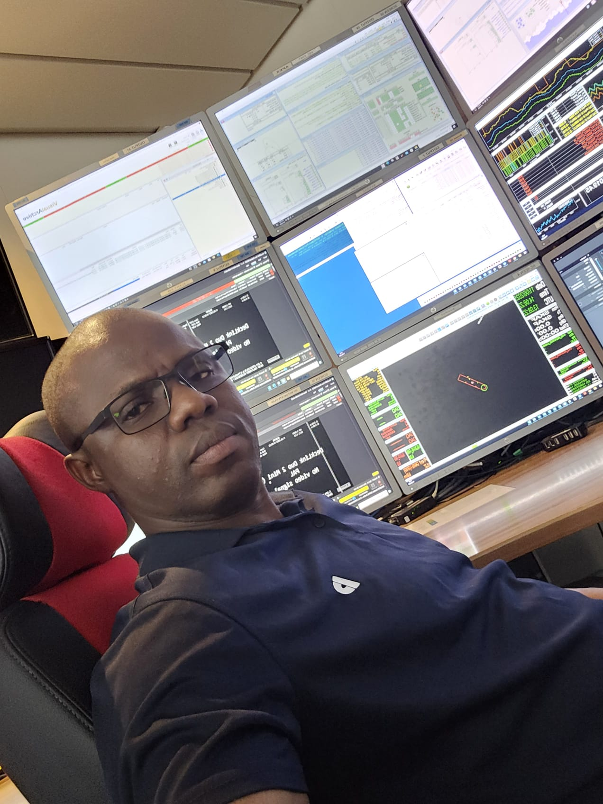

---
hide:
  - toc
  - navigation
---

<!--
CHECKLIST FOR THIS PAGE:
- [ ] Replace [YOUR NAME] with your full name (3 places)
- [ ] Replace [YOUR JOB TITLE] with your current or target role
- [ ] Replace [YOUR TAGLINE] with a short phrase describing your focus
- [ ] Rewrite the About Me paragraph with your own words
- [ ] Replace assets/images/profile.png with your actual photo (keep the filename or update it below)
- [ ] Replace assets/images/about.png with your own image (a field photo, map, or workspace shot)
- [ ] Edit the skill cards to match your actual skills (add, remove, or rename cards as needed)
- [ ] Update GitHub and LinkedIn links in the Connect section
- [ ] Add your CV PDF to docs/assets/ and update the filename in the Download CV button
-->

<h1>Oluwaseun Oyemakinde</h1>

Geospatial Data Analyst | GIS & Remote Sensing Specialist

<em>Transforming satellite imagery, GIS and spatial data into actionable insights for environmental management, infrastructure, offshore operations and public sector decision-making</em>

[Download CV :material-download:](assets/oluwaseun-cv.pdf){ .md-button .md-button--primary }
---

## At a Glance

- :material-map-marker:{ .lg .middle } **Location**

    **Falkirk, Scotland, UK**

    Available for opportunities across the UK and internationally.

- :material-school:{ .lg .middle } **Education**

    **MSc Geographic Information Systems**

    University of Aberdeen

- :material-briefcase:{ .lg .middle } **Experience**

    GIS • Remote Sensing • Hydrography • UAV Mapping • Spatial Data Management

- :material-code-json:{ .lg .middle } **Primary Technologies**

    ArcGIS Pro • QGIS • Python • SQL • ArcPy • PostGIS

---

## About Me

I am a **Geospatial Data Analyst** with experience in **GIS, remote sensing, hydrographic data processing, UAV mapping and spatial data management**. My work focuses on transforming complex geospatial datasets into clear, evidence-based insights that support environmental management, infrastructure planning, offshore operations and public sector decision-making.

My experience spans satellite imagery, hydrographic survey data, environmental monitoring and enterprise GIS workflows. I enjoy integrating spatial analysis, automation and visualisation to solve real-world problems, whether processing offshore survey data, analysing environmental change or developing interactive spatial dashboards.

I work with **ArcGIS Pro, QGIS, Python, SQL, PostGIS and modern geospatial technologies** to build reproducible workflows, automate analysis and communicate results through high-quality maps, dashboards and technical reports.

This portfolio showcases projects covering **GIS analysis, remote sensing, environmental modelling, hydrographic data processing, Python automation and spatial decision support**, demonstrating both my technical capabilities and my approach to solving complex geospatial challenges.

---

## Featured Projects

- ### 🌍 Urban Heat Island & Air Quality Analysis

    Investigated the relationship between **Land Surface Temperature, NO₂, land use change and population exposure** across Lagos State using MODIS, Landsat and ArcGIS Pro.

    `Remote Sensing` `ArcGIS Pro` `Python` `Environmental GIS`

    [View Project →](projects/urban-heat-island.md){ .md-button }

- ### 🛢️ UK Continental Shelf Oil Production Analysis

    Applied exploratory spatial analysis, SQL and geostatistics to investigate historical offshore oil production, geological basins and production trends across the UK Continental Shelf.

    `GIS` `Spatial Analysis` `SQL` `Cartography`

    [View Project →](projects/ukcs-oil-production.md){ .md-button }

---

## Core Expertise

- :material-map-search:{ .lg .middle } **GIS & Spatial Analysis**

    Design, manage and analyse geospatial data to support evidence-based decision making.

    **Technologies**
    - ArcGIS Pro
    - ArcGIS Online
    - QGIS
    - Spatial Analyst
    - Cartography
    - Geostatistics
    - Network Analysis
    - GDAL / OGR

- :material-satellite-variant:{ .lg .middle } **Remote Sensing & Earth Observation**

    Process and analyse satellite and aerial imagery for environmental monitoring and land-use analysis.

    **Experience**
    - Google Earth Engine
    - Landsat
    - Sentinel-1 & Sentinel-2
    - MODIS
    - SAR Imagery
    - NDVI & Spectral Indices
    - Raster Processing

- :material-code-braces:{ .lg .middle } **Programming & Data Analysis**

    Automate GIS workflows and perform reproducible spatial analysis.

    **Languages & Libraries**
    - Python
    - ArcPy
    - GeoPandas
    - Pandas
    - NumPy
    - Matplotlib
    - SQL
    - PostgreSQL + PostGIS

- :material-web:{ .lg .middle } **Web GIS & Visualisation**

    Develop interactive dashboards and web mapping applications for communicating spatial insights.

    **Frameworks**
    - Streamlit
    - Folium
    - Leaflet.js
    - MapLibre GL
    - GeoJSON

- :material-database-cog:{ .lg .middle } **Geospatial Data Engineering**

    Build scalable workflows for storing, transforming and managing spatial datasets.

    **Technologies**
    - PostgreSQL
    - PostGIS
    - GeoPackage
    - GeoParquet
    - GeoTIFF
    - NetCDF
    - AWS S3
    - Google Cloud Storage

- :material-drone:{ .lg .middle } **UAV Mapping & Photogrammetry**

    Capture, process and analyse UAV imagery for mapping and 3D reconstruction.

    **Software**
    - Agisoft Metashape
    - Pix4D Mapper
    - OpenDroneMap
    - PDAL
    - Point Cloud Processing
    - Mission Planning
    - Orthomosaic Generation
    - Digital Surface Models

---

## Professional Competencies

- :material-chart-line:{ .lg .middle } **Spatial Analytics**

    Spatial statistics • Change Detection • Interpolation • Environmental Modelling • Hotspot Analysis

- :material-map-marker-path:{ .lg .middle } **Cartography & Visualisation**

    Publication-quality mapping • Layout Design • Symbology • Data Visualisation • Spatial Storytelling

- :material-robot-outline:{ .lg .middle } **Automation**

    Python • ArcPy • Workflow Optimisation • Batch Processing • Reproducible Analysis

- :material-account-group:{ .lg .middle } **Project Delivery**

    Requirements Gathering • Stakeholder Engagement • Technical Reporting • Documentation • Agile Working

---

## Professional Development

- :material-school:{ .lg .middle }

    **Currently Developing**
    - Geospatial Data Engineering
    - Cloud-native GIS
    - DuckDB & GeoParquet
    - dbt
    - Apache Airflow
    - Advanced PostGIS
    - GeoAI & Machine Learning

---

## Certifications & Continuous Learning

- :material-certificate:{ .lg .middle }

    - Geospatial Data Engineering
    - Scrum with AI Certified
    - Scrum Fundamentals Certified
    - Application of GIS in Conservation Mapping
    - ArcGIS Python Scripting
    - Point Cloud Processing & 3D Visualisation
    - CoRise SQL Crash Course

---

## Explore My Portfolio

This portfolio demonstrates practical experience across a broad range of geospatial disciplines.

- 🌍 GIS & Spatial Analysis
- 🛰 Remote Sensing
- 🗺 Cartography & Data Visualisation
- 🌊 Hydrographic Data Processing
- 🚁 UAV Mapping
- 🐍 Python Automation
- 🛢 Energy & Environmental Analysis
- 📊 Spatial Decision Support

---

## Let's Connect

I'm always interested in discussing **GIS, remote sensing, hydrography, geospatial data engineering and spatial data science**, as well as opportunities to collaborate on projects that use geospatial technology to solve real-world challenges.

[:fontawesome-brands-github: GitHub](https://github.com/seunoye){ .md-button .md-button--primary }

[:fontawesome-brands-linkedin: LinkedIn](https://linkedin.com/in/oluwaseunoyemakinde){ .md-button }

[:material-email: Email](mailto:seunoyemakinde@hotmail.com){ .md-button }