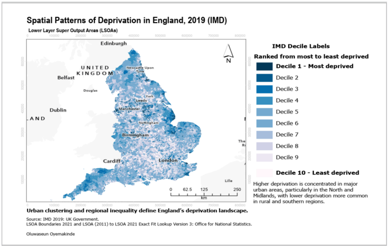
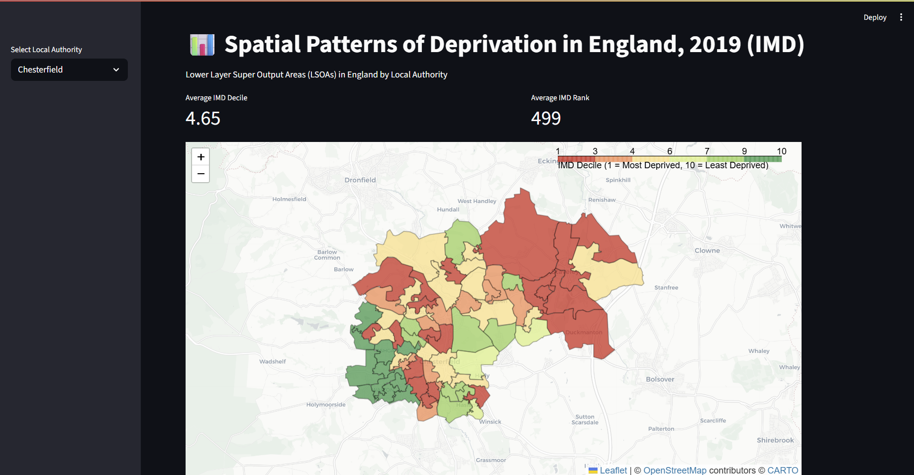

<!--
hide:
  - toc
  - navigation
-->

<!--
CHECKLIST FOR THIS PAGE (copy this file for each new project):
- [ ] Replace [YOUR PROJECT TITLE] with your project title
- [ ] Replace the hero image with your own (add to docs/assets/images/)
- [ ] Update the Overview section
- [ ] Update the Methods & Tools section
- [ ] Update the Key Findings section
- [ ] Update the Links section
- [ ] Add a card for this project on docs/projects/index.md
- [ ] Add a nav entry in mkdocs.yml
-->

# 🗺️ Spatial Patterns of Deprivation in England (IMD 2019)



## Overview

This project explores the spatial distribution of multiple deprivation across England using the **Index of Multiple Deprivation (IMD) 2019**, mapped at **Lower Layer Super Output Area (LSOA)** level and aggregated for exploration by **Local Authority District**.

I built an end-to-end pipeline that merges official ONS deprivation statistics with LSOA boundary and lookup data, then developed an interactive **Streamlit dashboard** to let users filter by Local Authority and explore deprivation decile patterns through a choropleth map and distribution chart. The project demonstrates a reproducible geospatial data engineering workflow — from raw government open data through to a deployable, interactive analytical tool.

**Study Area:** England (LSOA level, Local Authority filtering)

**Data Vintage:** IMD 2019, LSOA 2021 boundaries

**Role:** Independent work, developed for a presentation

**Status:** Completed (March 2026)

---

## Methods & Tools

### Data Sources

| Dataset | Source | Purpose |
|----------|---------|----------|
| Index of Multiple Deprivation (IMD) 2019 | UK Government (MHCLG) | Deprivation decile and rank scores |
| LSOA (2011) to LSOA (2021) Exact Fit Lookup v3 | Office for National Statistics | Linking 2011 IMD geography to 2021 LSOA boundaries |
| LSOA 2021 Boundaries | Office for National Statistics | Spatial geometry for mapping |

---

### Processing Workflow

1. Loaded IMD 2019 scores, the LSOA 2011→2021 exact-fit lookup, and LSOA 2021 boundary geometries.
2. Cleaned column names and joined the lookup table to the IMD dataset on LSOA (2011) code.
3. Joined the merged attribute table to LSOA 2021 boundary geometry.
4. Filtered records to England only (LSOA codes prefixed "E").
5. Converted IMD Decile and Rank fields to numeric types, handling non-numeric values.
6. Reprojected geometry to WGS84 (EPSG:4326) for web mapping.
7. Exported the processed dataset as a GeoPackage for use in the dashboard.
8. Built a Streamlit app with a Local Authority filter, summary metrics, an interactive Folium choropleth, and an Altair distribution chart.

---

### Tools Used

| Tool | Purpose |
|------|---------|
| Python | Data automation and pipeline scripting |
| Pandas | Tabular data cleaning and merging |
| GeoPandas | Spatial joins, filtering and reprojection |
| Streamlit | Interactive dashboard framework |
| Folium | Choropleth mapping with tooltips and popups |
| Altair | Decile distribution charting |
| GeoPackage (GPKG) | Spatial data storage format |

---

## Environment Setup

```
    import pandas as pd
    import geopandas as gpd
    import streamlit as st
    import folium
    from streamlit_folium import st_folium
    import altair as alt
```

## Data Pre-processing

### Merging IMD Scores with Boundaries

The pipeline joins three separate government datasets — deprivation scores, a geography lookup, and boundary geometry — into a single analysis-ready spatial layer, filtered to England and reprojected for web mapping.

```
    merged_table = df_lookup.merge(df_imd, left_on='LSOA11CD', right_on='LSOA code (2011)', how='inner')
    gdf = gdf_lsoa.merge(merged_table, on='LSOA21CD', how='inner')
    gdf = gdf[gdf['LSOA21CD'].str.startswith('E')]
    gdf["IMD_Decile"] = pd.to_numeric(gdf["Index of Multiple Deprivation (IMD) Decile"], errors='coerce')
    gdf["IMD_Rank"] = pd.to_numeric(gdf["Index of Multiple Deprivation (IMD) Rank"], errors='coerce')
    gdf = gdf.to_crs(epsg=4326)
```

---

## Results

### National Deprivation Pattern


The national map shows clear urban clustering of higher deprivation (Decile 1–3) concentrated in major cities and the North and Midlands, with lower deprivation more common in rural and southern regions of England.

---

### Interactive Local Authority Explorer



The Streamlit dashboard allows a user to select a Local Authority and view:

- Average IMD Decile and average IMD Rank as headline metrics.
- An interactive Folium choropleth of LSOAs, coloured by decile (RdYlGn), with hover tooltips and click popups showing Local Authority, LSOA code, decile and rank.
- An Altair bar chart showing the distribution of LSOAs across deciles within the selected Local Authority.

```
    folium.Choropleth(
        geo_data=filtered.__geo_interface__,
        data=filtered,
        columns=["LSOA21CD", "IMD_Decile"],
        key_on="feature.properties.LSOA21CD",
        fill_color="RdYlGn",
        fill_opacity=0.75,
        line_opacity=0.2,
        legend_name="IMD Decile (1 = Most Deprived, 10 = Least Deprived)"
    ).add_to(m)
```

---

## Key Findings

- Built a reproducible pipeline linking IMD 2019 scores to current (2021) LSOA geography via the ONS exact-fit lookup.
- Produced a national choropleth revealing strong urban–rural and North–South deprivation contrasts across England.
- Delivered an interactive, filterable dashboard enabling Local Authority-level exploration rather than a static map alone.
- Demonstrated an end-to-end open geospatial data workflow: acquisition, spatial joins, cleaning, reprojection, and interactive delivery.

---

## Skills Demonstrated

`Geospatial Data Engineering`

`Python`

`GeoPandas`

`Pandas`

`Spatial Joins`

`Streamlit`

`Folium`

`Altair`

`Choropleth Mapping`

`Open Government Data`

`Dashboard Development`

`Cartography`

---

## Notes

The processed GeoPackage output (LSOA boundaries joined with IMD scores) is a large file and is not included in a repository for this project; the pipeline script and dashboard code above are sufficient to reproduce it from the public ONS/MHCLG sources listed above.
