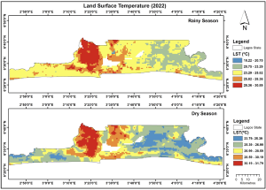
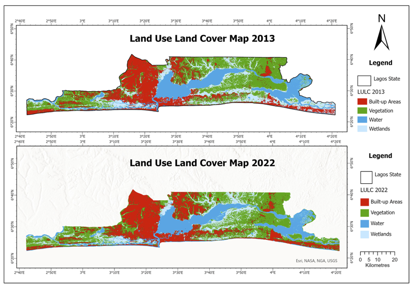

---
hide:
  - toc
  - navigation
---
<!--
CHECKLIST FOR THIS PAGE:
- [ ] Replace the two placeholder cards (marked [YOUR PROJECT ...]) with your real projects
- [ ] For each project: add a thumbnail image to docs/assets/images/ and update the path below
- [ ] For each project: create a project page by copying sample-project.md
- [ ] For each project: add a nav entry in mkdocs.yml (see the comments there)
- [ ] Delete placeholder cards you don't need yet
-->

# Projects

A selection of my geospatial projects. Click any card to see the full write-up.

**[Urban Heat Island & Air Quality Analysis](urban-heat-island.md)**

Explored Lagos UHI patterns using MODIS and Landsat, mapped NO₂ hotspots, and evaluated population exposure with GIS.

`GIS` `Remote Sensing` `Python`

[View Project →](urban-heat-island.md){ .md-button }

**[Jupyter Notebook Project](urban-heat-islands-lagos.ipynb)**

Jupyter notebook demonstrating LST and NO₂ analysis across Lagos.

`Python` `pandas` `Matplotlib`

[View Project →](urban-heat-islands-lagos.ipynb){ .md-button }

