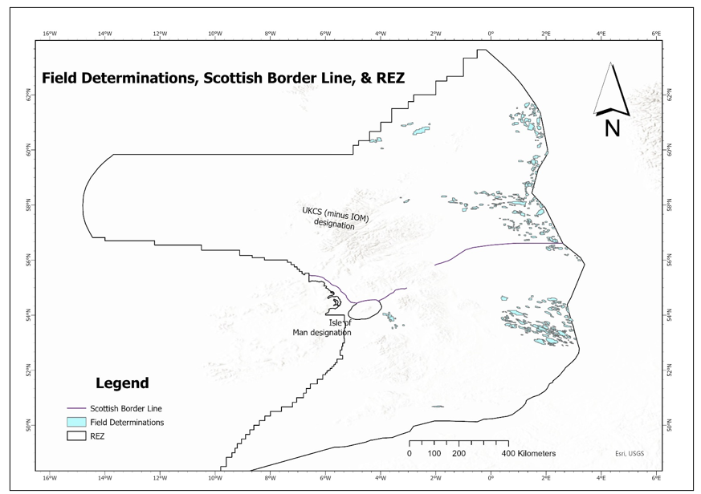
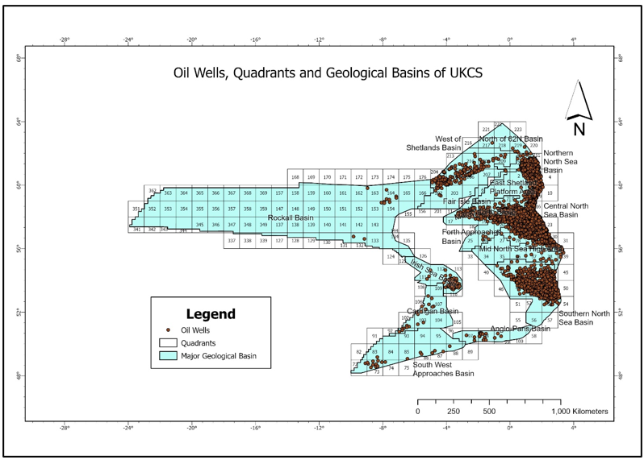
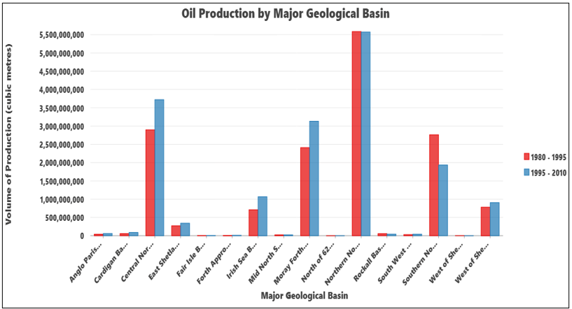
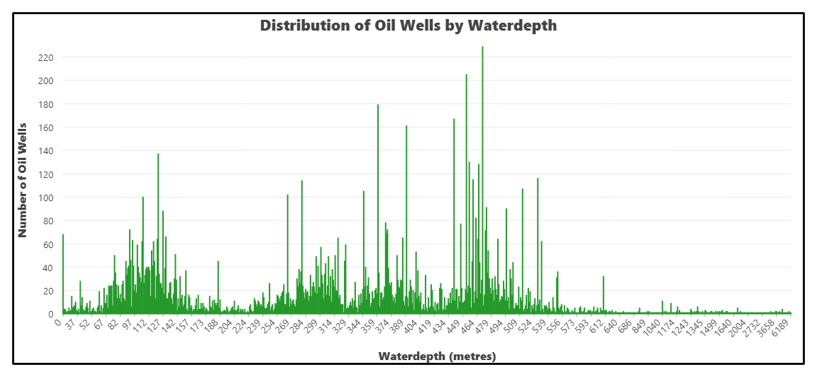
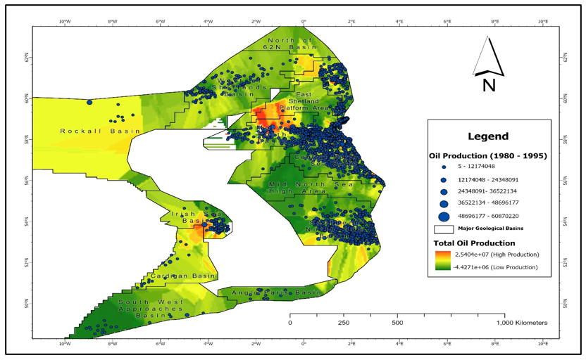
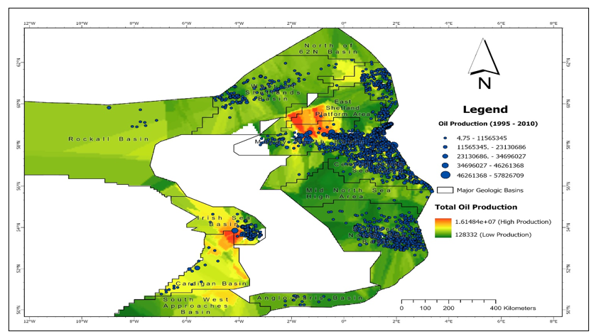
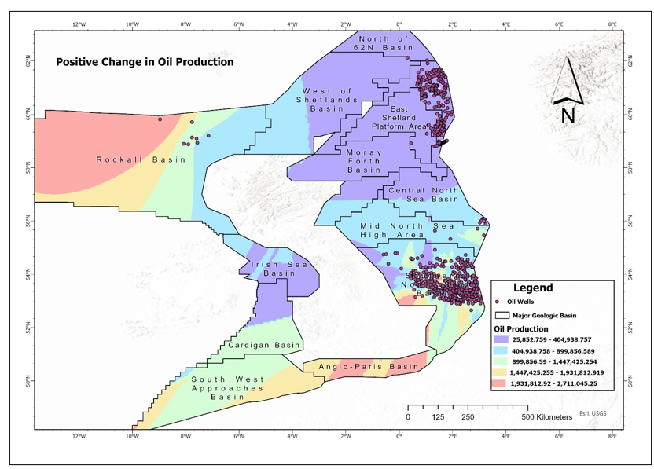
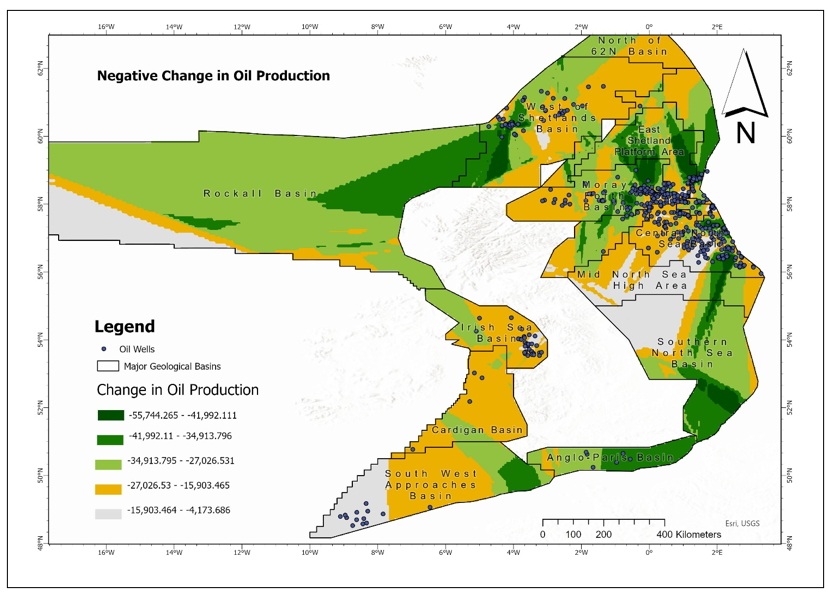
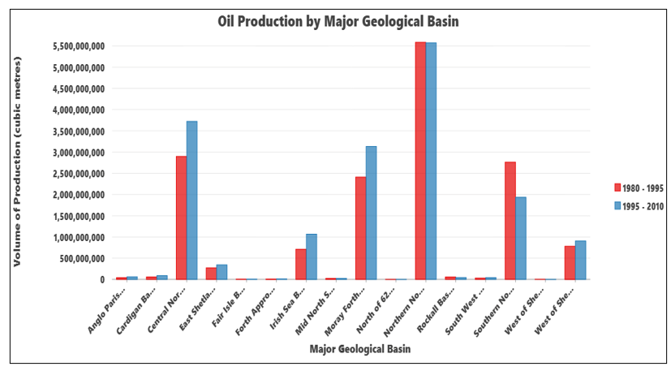
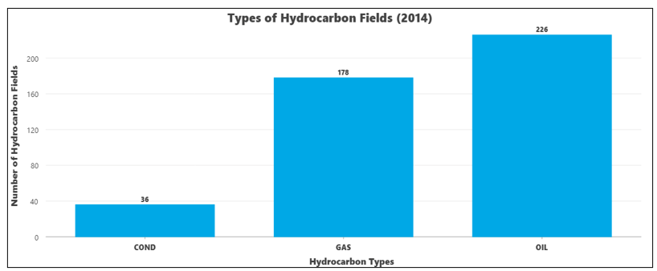

---
hide:
  - toc
  - navigation
---

# 🛢️ Spatial Analysis of UK Continental Shelf Oil Production (1980–2010)

## Overview

This independent GIS analysis explored historical oil production across the **United Kingdom Continental Shelf (UKCS)** between **1980–1995** and **1995–2010**. The project combined spatial datasets, production records and geological information to investigate the spatial distribution of offshore oil production, identify production hotspots, compare temporal changes, and communicate findings through professional cartographic outputs.

Using ArcGIS Pro, SQL-based data management and exploratory spatial analysis techniques, I developed a complete workflow for integrating spatial and non-spatial datasets, producing thematic maps, generating statistical summaries and applying geostatistical interpolation to reveal spatial production patterns across major geological basins.

Rather than simply mapping oil wells, the project focused on understanding **where production occurred, how production changed over time, and which geological basins contributed most to the UK's offshore oil industry.**

**Study Area:** United Kingdom Continental Shelf (UKCS)

**Study Period:** 1980–2010

**Role:** Independent GIS Analysis

**Status:** Completed

---

# Project Objectives

The project aimed to:

- Explore the spatial distribution of offshore oil wells.
- Analyse oil production between two historical production periods.
- Identify production hotspots using geostatistical interpolation.
- Examine production differences across geological basins.
- Investigate relationships between production, water depth and well density.
- Produce publication-quality maps and charts to support spatial interpretation.

---

# Methods & Tools

## Data Sources

| Dataset | Purpose |
|----------|---------|
| UK Continental Shelf Oil Wells | Offshore well locations |
| UKCS Production Database | Historical production records |
| Geological Basins | Basin classification |
| Quadrant Grid | Spatial indexing |
| Bathymetry / Water Depth | Water depth analysis |
| Hydrocarbon Fields (2014) | Additional exploratory analysis |

---

## GIS Workflow

1. Imported and validated offshore spatial datasets.
2. Joined production records to oil well locations using unique identifiers.
3. Cleaned and verified attribute data.
4. Explored production statistics using SQL queries and ArcGIS attribute tools.
5. Produced thematic maps illustrating oil production for both study periods.
6. Applied Kriging interpolation to model continuous production surfaces.
7. Calculated production change using Field Calculator.
8. Analysed production by geological basin, quadrant and water depth.
9. Produced publication-quality maps, charts and summary statistics.

---

## Software Used

| Software | Purpose |
|----------|---------|
| ArcGIS Pro | Spatial analysis, cartography and geoprocessing |
| Spatial Analyst | Kriging interpolation and raster analysis |
| SQL | Data querying and attribute management |
| Microsoft Excel | Data preparation and tabular analysis |

---

# Study Area

The study covers the **United Kingdom Continental Shelf (UKCS)**, one of Europe's most significant offshore petroleum regions. Oil wells are concentrated within major North Sea geological basins, with smaller clusters located in the Irish Sea, West of Shetland and South West Approaches.

---

# Exploratory Spatial Data Analysis

The analysis began by integrating spatial and production datasets to examine how oil wells were distributed across geological basins, quadrants and water depths.

The exploratory analysis revealed clear spatial clustering within the **Northern North Sea**, **Central North Sea**, **Moray Firth** and **Southern North Sea** basins, providing an initial understanding of production concentration before applying interpolation techniques.

---

# Spatial Distribution of Oil Wells

## Major Geological Basins

The Northern North Sea Basin contained the largest concentration of offshore oil wells, followed by the Central North Sea, Moray Firth and Southern North Sea basins. These four basins accounted for the majority of productive offshore activity.

---

## Water Depth Analysis

Oil production was strongly associated with relatively shallow offshore environments. Most productive wells were located within water depths of approximately **100–600 metres**, highlighting the relationship between geological setting and historical offshore development.

---

# Oil Production Surface Modelling

## Oil Production (1980–1995)

---

## Oil Production (1995–2010)

Spatial interpolation using **Ordinary Kriging** transformed discrete well production values into continuous production surfaces, allowing production hotspots to be visualised across the UK Continental Shelf.

The interpolation highlighted persistent production centres within the:

- Northern North Sea Basin
- Central North Sea Basin
- Moray Firth Basin
- Southern North Sea Basin
- Irish Sea Basin

These regions consistently exhibited the highest production throughout both study periods.

---

# Production Change Analysis

## Positive Change in Production

Spatial comparison identified areas where production increased between the two study periods. Production growth was concentrated within the North Sea and West of Shetland regions, indicating continued development of mature offshore fields.

---

## Negative Change in Production

Areas exhibiting declining production were mapped to identify mature fields experiencing reduced output. These maps provide valuable insight into the changing spatial dynamics of offshore oil production over time.

---

# Comparative Production Analysis

## Production by Major Geological Basin

Comparison of production totals across geological basins showed that the **Northern North Sea Basin** remained the UK's dominant producing region throughout both study periods, followed by the Central North Sea, Moray Firth and Southern North Sea basins.

---

## Hydrocarbon Field Types

The hydrocarbon inventory demonstrated that oil fields represented the largest proportion of UK offshore hydrocarbon resources, with gas fields also contributing substantially to national production.

---

# Key Findings

- Integrated spatial and production datasets to create a comprehensive GIS analysis workflow.
- Applied geostatistical interpolation (Ordinary Kriging) to model offshore production surfaces.
- Identified major production hotspots across the UK Continental Shelf.
- Quantified production differences between two historical production periods.
- Demonstrated that the **1995–2010** period produced a higher overall production output than **1980–1995**.
- Analysed relationships between production, geological basin and offshore water depth.
- Produced professional cartographic outputs suitable for technical reporting and decision support.

---

# Skills Demonstrated

`ArcGIS Pro`

`Spatial Analysis`

`Exploratory Spatial Data Analysis (ESDA)`

`Geostatistics`

`Ordinary Kriging`

`SQL`

`Data Integration`

`Spatial Joins`

`Cartography`

`Thematic Mapping`

`Raster Analysis`

`Geological Data Analysis`

`Spatial Visualisation`

`Data Interpretation`

`Technical Reporting`

---

# Project Impact

This project demonstrates the application of Geographic Information Systems to large-scale energy datasets, combining spatial analysis, geostatistics and cartographic design to transform complex offshore production records into meaningful spatial intelligence.

The workflow showcases practical skills in data integration, exploratory spatial analysis, interpolation modelling and professional map production that are directly transferable to geospatial roles across the energy, environmental, infrastructure and natural resources sectors.