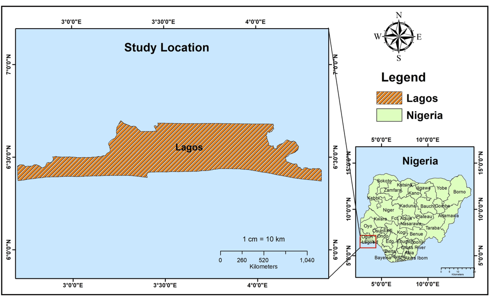
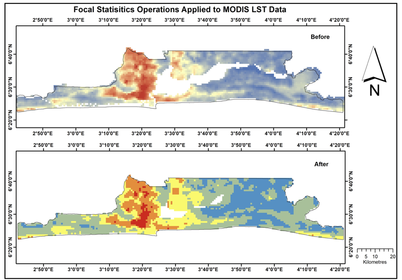
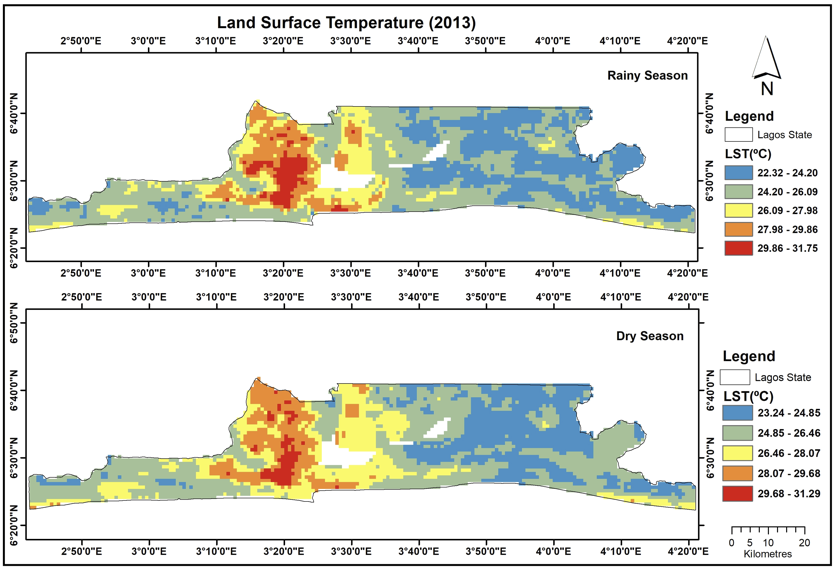
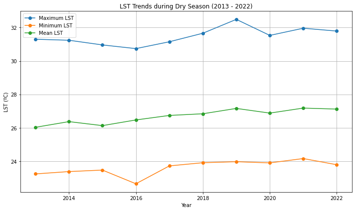
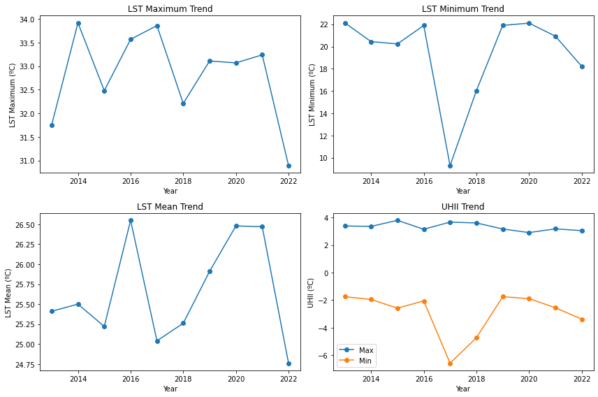
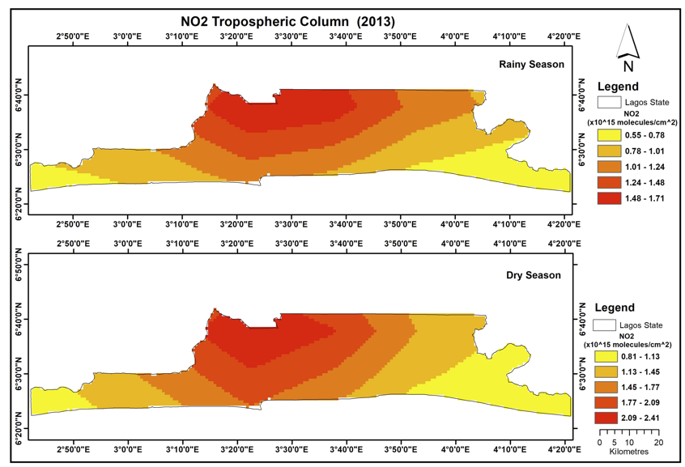
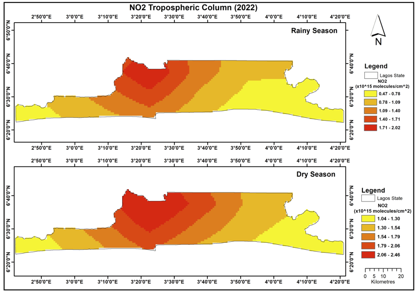
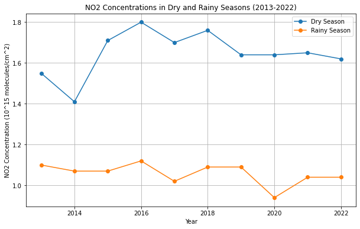

<!--
CHECKLIST FOR THIS PAGE (copy this file for each new project):
- [ ] Replace [YOUR PROJECT TITLE] with your project title
- [ ] Replace the hero image with your own (add to docs/assets/images/)
- [ ] Update the Overview section
- [ ] Update the Methods & Tools section
- [ ] Update the Key Findings section
- [ ] Update the Links section
- [ ] Add a card for this project on docs/projects/index.md
- [ ] Add a nav entry in mkdocs.yml
-->

# 🌍 Urban Heat Island & Air Quality Analysis

## Overview

This MSc research project investigated the spatial and temporal relationship between **Urban Heat Island (UHI) intensity**, **land surface temperature (LST)**, **nitrogen dioxide (NO₂)**, **land use/land cover (LULC) change**, and **population exposure** across Lagos State, Nigeria.

Using satellite remote sensing and Geographic Information Systems (GIS), I developed a reproducible workflow to analyse a decade (2013–2022) of environmental change. The project integrated Earth Observation datasets from NASA and USGS with GIS analysis and statistical techniques to identify environmental hotspots and support evidence-based urban planning.

**Study Area:** Lagos State, Nigeria

**Duration:** January 2013 – December 2022

**Role:** MSc Research Project (University of Aberdeen)

**Status:** Completed

---

## Methods & Tools

### Data Sources

| Dataset | Source | Purpose |
|----------|---------|----------|
| MODIS Aqua (MYD11A2) | NASA Earthdata | Land Surface Temperature |
| OMI Aura | NASA Earthdata | Tropospheric NO₂ |
| Landsat 8 | USGS | Land Use / Land Cover Classification |
| GRID3 Population | GRID3 | Population Exposure |
| Lagos Boundary | GADM | Study Area |

---

### Processing Workflow

1. Downloaded MODIS, Landsat and NO₂ satellite datasets.
2. Pre-processed imagery using ArcGIS Pro and Python.
3. Filled missing raster values using Focal Statistics.
4. Generated seasonal and annual Land Surface Temperature maps.
5. Analysed NO₂ concentration patterns.
6. Produced Land Use/Land Cover classifications.
7. Performed Pearson correlation analysis between LST and NO₂.
8. Combined environmental indicators with population data to identify high-risk communities.

---

### Tools Used

| Tool | Purpose |
|------|---------|
| ArcGIS Pro | Raster processing, spatial analysis and cartography |
| Python | Data automation and statistical analysis |
| ArcPy | Raster geoprocessing |
| SPSS | Correlation analysis |
| Microsoft Excel | Data preparation |
| MODIS & Landsat | Earth Observation datasets |

---

## Study Area

The study focused on Lagos State, Nigeria, one of Africa's fastest-growing metropolitan regions. Rapid urbanisation, industrial development and population growth make Lagos an ideal case study for analysing Urban Heat Island effects and environmental change.

---

## Data Pre-processing

### Filling Missing MODIS Pixels

MODIS imagery contained missing values caused primarily by cloud contamination. Focal Statistics was applied to interpolate missing pixels and improve the continuity of the land surface temperature dataset before seasonal analysis.

---

## Results

### Land Surface Temperature

#### 2013

#### 2022

 
The analysis showed a clear increase in the spatial extent of higher land surface temperatures between 2013 and 2022, particularly across highly urbanised areas.

---

### Temperature Trends

Seasonal trend analysis demonstrated:

- Increasing dry-season temperatures.
- Relatively stable rainy-season temperatures.
- Persistent Urban Heat Island intensity throughout the study period.

---

### Rainy Season Analysis

The rainy season exhibited lower average land surface temperatures but continued to display pronounced spatial variation across the study area.

---

### Nitrogen Dioxide Analysis

#### NO₂ Distribution (2013)

#### NO₂ Distribution (2022)

NO₂ concentrations remained highest within densely urbanised regions and major transport corridors.

---

### NO₂ Trends

Time-series analysis highlighted seasonal variability while showing that pollution hotspots remained spatially consistent over the study period.

---

### Land Use / Land Cover Change

Comparison of 2013 and 2022 classifications revealed:

- Expansion of built-up areas.
- Reduction in wetland extent.
- Changes in vegetation distribution associated with urban growth.

---

### Population Exposure

Environmental indicators were integrated with population data to identify Local Government Areas where high temperatures and elevated NO₂ concentrations coincided with greater population exposure.

---

## Key Findings

- Analysed ten years of satellite-derived environmental data (2013–2022).
- Identified increasing land surface temperatures across urban areas.
- Detected substantial land-use change driven by urban expansion.
- Mapped spatial distribution of NO₂ concentrations.
- Identified Local Government Areas with elevated environmental risk.
- Produced decision-support maps suitable for urban planning and environmental management.

---

## Skills Demonstrated

`Remote Sensing`

`GIS`

`ArcGIS Pro`

`Python`

`ArcPy`

`Raster Analysis`

`Spatial Statistics`

`Land Surface Temperature`

`NO₂ Analysis`

`MODIS`

`Landsat`

`Cartography`

`Environmental Modelling`

`Scientific Research`

---

## Repository

[View Code on GitHub](https://github.com/seunoye/urban-heat-island-analysis){ .md-button .md-button--primary }

[View Dissertation][def]{ .md-button }

[def]: ../assets/dissertation.pdf